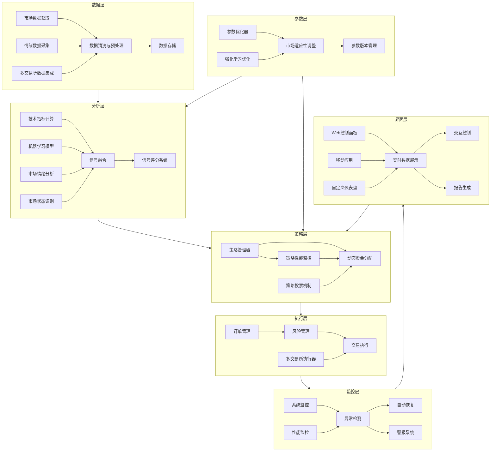
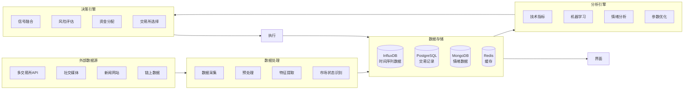
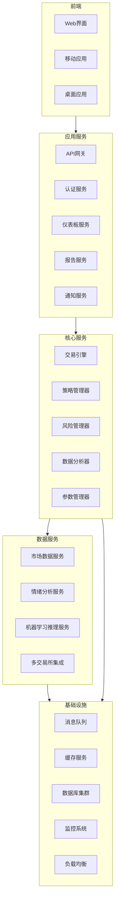

# 智能化交易系统技术方案设计

## 总体架构

智能化交易系统将采用模块化、分层设计，保持核心交易引擎的高性能与可靠性，同时添加更多智能决策组件。系统将由以下几个核心层组成：

1. **数据层**：负责数据获取、存储、清洗和预处理
2. **分析层**：包含技术指标、机器学习模型和市场情绪分析
3. **策略层**：管理多策略集成与资金分配
4. **执行层**：处理订单管理、风险控制和实时交易执行
5. **监控层**：系统监控、报警与自动恢复
6. **界面层**：用户界面和控制面板
7. **参数层**：自适应参数优化和管理
8. **集成层**：多交易所和多币种集成

### 系统架构图



## 技术选型

### 核心技术栈
- **编程语言**：Python 3.8+（主要开发语言）
- **数据处理**：Pandas, NumPy, Scikit-learn
- **机器学习**：PyTorch, TensorFlow, XGBoost, LightGBM
- **深度学习**：LSTM, Transformer, GRU 网络架构
- **强化学习**：OpenAI Gym, Stable Baselines3
- **Web框架**：
  - 后端：FastAPI（RESTful API和WebSocket支持）
  - 前端：React.js + Ant Design（响应式用户界面）
- **数据库**：
  - PostgreSQL（关系型数据，交易记录）
  - MongoDB（非结构化数据，市场情绪）
  - InfluxDB（时间序列数据，市场价格）
  - Redis（缓存和实时数据）
- **消息队列**：RabbitMQ/Kafka（模块间通信）
- **监控**：Prometheus + Grafana（系统监控和可视化）
- **容器化**：Docker + Kubernetes（部署和扩展）
- **CI/CD**：Jenkins/GitLab CI（持续集成和部署）
- **版本控制**：Git（源代码管理）

### 关键库与依赖
- **交易API**：ccxt（多交易所集成）
- **技术分析**：pandas_ta, ta-lib
- **机器学习**：scikit-learn, PyTorch, TensorFlow
- **自然语言处理**：spaCy, Transformers（市场情绪分析）
- **可视化**：Plotly, Dash, ECharts（交互式图表）
- **测试**：pytest, mock, pytest-asyncio
- **参数优化**：Optuna, Hyperopt, Ray Tune
- **套利库**：triangular-arbitrage, ccxt-arbitrage
- **WebSocket**：Socket.IO（实时数据传输）
- **安全认证**：JWT, OAuth2（用户认证）
- **日志管理**：ELK Stack（日志收集和分析）

## 模块设计

### 1. 实时交易执行引擎

**核心组件**：
- `LiveTradingEngine`：实时交易引擎主控制器
- `WebSocketDataManager`：WebSocket实时数据处理器
- `OrderManagementSystem`：订单管理系统
- `PositionManager`：仓位管理器
- `StateSynchronizer`：状态同步器
- `TrailingStopManager`：追踪止损管理器
- `TradingLogger`：交易日志记录器

**设计要点**：
- 采用事件驱动架构，通过WebSocket接收实时市场数据
- 实现全功能订单管理系统(OMS)，支持各种订单类型
- 提供可靠的状态同步机制，确保本地系统与交易所状态一致
- 实现动态追踪止损机制，保护已实现利润
- 支持多种异常处理和恢复机制
- 详细的日志记录系统，跟踪所有关键操作

**数据流**：
```
市场数据 → 信号生成 → 订单创建 → 订单执行 → 订单跟踪 → 仓位管理 → 状态同步
```

**关键流程**：
1. **市场数据流处理**：
   - 通过WebSocket接收实时Ticker、K线和深度数据
   - 数据预处理和规范化
   - 事件触发和分发

2. **订单管理**：
   - 创建多种类型订单（市价单、限价单、止盈止损单）
   - 订单状态跟踪和更新
   - 部分成交处理
   - 订单撤销和修改

3. **仓位管理**：
   - 实时仓位计算和跟踪
   - 持仓成本和未实现盈亏计算
   - 多头寸协调管理

4. **状态同步**：
   - 定期与交易所账户状态同步
   - 差异检测和自动修正
   - 重连和恢复机制

5. **动态止损**：
   - 基于价格走势的动态止损点计算
   - 止损订单自动更新
   - 多级止损策略

**技术实现**：
- 基于异步IO的WebSocket客户端
- 状态机设计的订单管理系统
- 事件驱动架构
- 并发控制和线程安全设计
- 健壮的错误处理和恢复机制

### 2. 机器学习驱动的交易信号增强

**核心组件**：
- `MLSignalEnhancer`：机器学习模型管理器
- `FeatureEngineering`：特征工程模块
- `ModelTrainer`：模型训练与验证
- `SignalPredictor`：信号生成与置信度评分
- `ModelEnsemble`：模型集成系统
- `ModelVersionManager`：模型版本管理

**设计要点**：
- 采用多模型集成方法（随机森林、XGBoost、LSTM网络、Transformer等）
- 特征工程包括价格模式、技术指标、交易量分析、波动率特征
- 使用滑动窗口交叉验证确保模型稳健性
- 实现在线学习机制，支持模型持续更新
- 预测输出包括方向概率和强度评分
- 模型性能实时监控与回滚机制

**数据流**：
```
历史价格数据 → 特征工程 → 模型训练 → 信号预测 → 置信度评分 → 信号融合
```

**实现技术**：
- Python scikit-learn、PyTorch或TensorFlow
- 使用GPU加速（用于深度学习模型）
- 并行处理框架（Dask或Ray）用于特征工程
- MLflow或DVC用于模型版本控制

### 3. 风险管理模块

**核心组件**：
- `RiskManager`：风险管理主控制器
- `PositionSizer`：动态头寸规模计算
- `LeverageAdjuster`：杠杆调整器（基于波动率）
- `RiskMetrics`：风险指标计算器
- `AdaptiveStopLoss`：自适应止损系统
- `DrawdownController`：回撤控制系统

**设计要点**：
- 动态计算最优头寸大小（基于Kelly公式变体）
- 根据市场波动性自动调整杠杆
- 实现多层次的风险预算系统
- 交易暂停机制（基于损失限额和异常检测）
- 基于VaR和CVaR的仓位规模计算
- 动态回撤控制和资金保护机制

**关键算法**：
- 波动性调整的头寸规模计算
- 基于历史波动率和预测波动率的自适应杠杆调整
- 风险敞口计算和分散化评分
- Monte Carlo VaR计算
- 动态止损距离计算

**风险监控指标**：
- 价值风险(VaR)
- 条件风险价值(CVaR)
- 夏普比率、索提诺比率动态监控
- 回撤控制与资金曲线健康度
- 波动率突变指标
- 风险暴露热图

### 4. 市场情绪分析

**核心组件**：
- `SentimentCollector`：数据采集器
- `SentimentAnalyzer`：情绪分析引擎
- `NewsImpactEvaluator`：新闻影响评估
- `SentimentIntegrator`：情绪信号集成器
- `FearGreedIndexCalculator`：恐惧贪婪指数计算器
- `SocialMediaAnalyzer`：社交媒体分析器

**数据来源**：
- 社交媒体（Twitter、Reddit等）
- 加密货币专业新闻网站
- 交易所数据（资金费率、未平仓合约等）
- 链上数据（大额交易、钱包活动）
- 情绪指标（恐惧与贪婪指数）
- 市场技术指标（如RSI、MFI）

**处理流程**：
1. 数据采集（API调用、网络爬虫）
2. 文本预处理（清洗、标准化）
3. 情绪分析（使用预训练NLP模型）
4. 情绪指标计算（恐惧与贪婪指数、看涨/看跌比例）
5. 信号生成与整合
6. 情绪趋势和异常检测

**实现技术**：
- Python爬虫框架（Scrapy）
- NLP库（spaCy、Transformers）
- 情感分析模型（BERT、FinBERT等）
- 异常检测算法（IsolationForest、One-class SVM）
- WebSocket实时数据流
- 词云生成和可视化

### 5. 多策略融合与动态配置

**核心组件**：
- `StrategyManager`：策略管理器
- `PerformanceEvaluator`：策略表现评估器
- `AllocationOptimizer`：资金分配优化器
- `StrategyFactory`：策略创建工厂
- `MarketStateClassifier`：市场状态分类器
- `StrategyVotingSystem`：策略投票系统

**设计要点**：
- 策略注册与管理系统
- 基于滑动窗口的策略表现评估
- 动态资金分配算法（基于表现和市场状态）
- 策略相关性分析与风险平衡
- 市场状态分类（趋势、震荡、突破）
- 策略投票和加权组合机制

**资金分配方法**：
- 基于策略表现的加权分配
- Kelly准则变体优化
- 基于市场状态的条件分配
- 相关性调整（降低高相关策略的总体权重）
- 胜率和盈亏比加权方法

**实现技术**：
- Python面向对象编程（策略设计模式）
- 数值优化库（SciPy）
- 并行处理（多进程/多线程）
- 层次聚类分析（策略相关性）
- 隐马尔可夫模型（市场状态识别）

### 6. 自动化系统监控与恢复

**核心组件**：
- `SystemMonitor`：系统监控器
- `HealthChecker`：健康检查器
- `RecoveryManager`：恢复管理器
- `AlertDispatcher`：警报分发器
- `PerformanceAnalyzer`：性能分析器
- `AnomalyDetector`：异常检测器

**监控指标**：
- API连接状态与延迟
- 数据流完整性
- 订单执行成功率与延迟
- 系统资源使用（CPU、内存、网络）
- 数据库连接与性能
- 性能下降模式
- 组件间通信延迟

**恢复策略**：
- 自动重连机制
- 失败订单重试逻辑
- 系统组件重启能力
- 降级运行模式
- 冷备份切换
- 灾难恢复计划

**通知渠道**：
- 电子邮件
- 短信/Telegram消息
- 系统内警报
- 日志记录与分析
- 可视化警报面板
- 严重级别分类

**实现技术**：
- 监控框架（Prometheus）
- 日志聚合（ELK栈）
- 状态检查API
- 守护进程
- 分布式追踪（Jaeger）
- 监控可视化（Grafana）

### 7. 交易绩效分析与优化

**核心组件**：
- `PerformanceAnalyzer`：绩效分析器
- `TradeJournal`：交易日志记录器
- `PatternRecognizer`：交易模式识别器
- `ParameterOptimizer`：参数优化器
- `TradeAttributor`：交易归因分析器
- `AutoOptimizer`：自动优化系统

**分析指标**：
- 基础回报指标（总回报、年化回报等）
- 风险调整指标（夏普比率、索提诺比率等）
- 回撤分析（最大回撤、回撤持续时间等）
- 交易统计（胜率、盈亏比、平均持仓时间等）
- 策略性能归因
- 市场条件相关性分析

**优化方法**：
- 网格搜索
- 遗传算法
- 贝叶斯优化
- 蒙特卡罗模拟
- 粒子群优化
- 强化学习优化

**实现技术**：
- pandas数据分析
- scikit-optimize（贝叶斯优化）
- plotly/dash（交互式可视化）
- 并行处理框架
- Optuna/Hyperopt（参数优化）
- 多目标优化算法

### 8. 用户界面和控制面板

**核心组件**：
- `DashboardServer`：仪表板服务器
- `APIGateway`：API网关
- `WebInterface`：网页界面
- `MobileApp`：移动应用
- `CustomizableDashboard`：可定制仪表盘
- `NotificationCenter`：通知中心

**界面功能**：
- 实时市场数据展示
- 持仓和账户状态
- 策略表现与配置
- 交易记录与分析
- 系统健康监控
- 手动干预控制
- 自定义仪表盘
- 策略参数调整界面

**技术栈**：
- 后端：FastAPI（API服务）
- 前端：React.js + Ant Design/Material UI
- 实时更新：WebSockets
- 图表：TradingView图表库、Plotly、ECharts
- 移动端：React Native
- 推送通知：Firebase Cloud Messaging

### 9. 回测与模拟交易增强

**核心组件**：
- `EnhancedBacktester`：增强型回测引擎
- `MarketSimulator`：市场条件模拟器
- `StatisticalAnalyzer`：统计分析器
- `MonteCarloSimulator`：蒙特卡洛模拟器
- `StepByStepExecutor`：步进执行器
- `AdversarialTester`：对抗性测试器

**增强功能**：
- 真实市场条件模拟（滑点、手续费、流动性限制）
- 统计显著性测试
- 蒙特卡洛模拟（随机市场条件生成）
- 步进模式与可视化
- 回测与实盘差异分析
- 多周期分析（多时间框架）
- 过拟合风险评估
- 极端市场条件模拟

**实现技术**：
- 事件驱动回测引擎
- 模拟订单簿重建
- 统计分析库（statsmodels）
- 并行蒙特卡洛模拟
- 交互式调试器
- 假设检验框架
- 过拟合检测算法

### 10. 自适应参数优化

**核心组件**：
- `AdaptiveParameterManager`：自适应参数管理器
- `MarketRegimeDetector`：市场状态检测器
- `ParameterMapper`：参数映射器
- `PerformanceTracker`：表现跟踪器
- `ReinforcementOptimizer`：强化学习优化器
- `ParameterVersionControl`：参数版本控制系统

**设计要点**：
- 基于市场波动率的动态参数调整
- 参数与市场状态的映射关系维护
- 连续参数有效性评估
- 参数变更历史记录与回滚能力
- 强化学习驱动的参数选择
- 多时间尺度优化
- 参数效果可视化分析

**优化目标**：
- 动态调整ATR倍数
- 优化DEMA周期参数
- 调整风险管理参数
- 优化信号过滤阈值
- 调整止盈止损距离

**实现技术**：
- 强化学习算法（PPO, A2C, DQN）
- 时间序列聚类
- 状态空间模型
- 参数敏感度分析
- 马尔可夫决策过程建模
- 自适应控制理论应用

### 11. 市场状态识别系统

**核心组件**：
- `MarketStateClassifier`：市场状态分类器
- `StrategySelector`：策略选择器
- `PerformanceAnalyzer`：策略-状态表现分析器
- `StateTransitionDetector`：状态转换检测器
- `StateVisualization`：状态可视化模块
- `ManualOverrideManager`：手动覆盖管理器

**设计要点**：
- 无监督学习自动识别市场状态
- 构建策略-市场状态映射和表现数据库
- 状态转变检测和平滑处理
- 多指标综合决策
- 市场状态历史分析
- 直观可视化界面

**状态分类**：
- 趋势状态（上升/下降）
- 震荡状态（窄幅/宽幅）
- 高波动状态
- 突破状态
- 异常状态

**实现技术**：
- 聚类算法（K-means, DBSCAN）
- 隐马尔可夫模型（HMM）
- 技术指标组合分析
- 统计特征提取
- 动态时间规整（DTW）
- 决策树和随机森林

**状态-策略映射**：
- 趋势状态 → 趋势跟踪策略（Supertrend）
- 震荡状态 → 均值回归策略
- 高波动状态 → 波动率策略或降低风险敞口
- 突破状态 → 突破确认策略
- 混合状态 → 综合策略或降低仓位

### 12. 多交易所和多币种支持

**核心组件**：
- `ExchangeManager`：交易所管理器
- `MultiAssetTrader`：多资产交易器
- `ArbitrageFinder`：套利机会探测器
- `CrossExchangeRiskManager`：跨交易所风险管理器
- `LiquidityAggregator`：流动性聚合器
- `UnifiedReportingSystem`：统一报告系统

**设计要点**：
- 统一多交易所API接入
- 跨交易所账户和订单管理
- 多交易对资金分配与风险控制
- 套利机会检测与执行
- 交易所冗余和自动切换
- 全球市场数据整合
- 多币种投资组合管理

**套利策略**：
- 统计套利
- 三角套利
- 跨交易所套利
- 现货期货套利
- 清算套利

**实现技术**：
- CCXT库（交易所API整合）
- 消息队列（订单路由）
- 分布式数据库（账户状态）
- 订单管理状态机
- 分布式锁（避免重复交易）
- 实时数据总线

### 13. 数据库与系统架构

**核心组件**：
- `TimeSeriesDBManager`：时间序列数据库管理器
- `RelationalDBManager`：关系型数据库管理器
- `DataReplicationService`：数据复制服务
- `DataPartitionManager`：数据分区管理器
- `MicroserviceOrchestrator`：微服务编排器
- `ContainerDeploymentManager`：容器部署管理器

**设计要点**：
- 时序数据与关系数据分离存储
- 高效查询和处理大量历史数据
- 数据分区和归档策略
- 水平扩展和负载均衡
- 高可用性和故障恢复
- 容器化部署和编排

**数据库架构**：
- **时间序列数据库**（InfluxDB/TimescaleDB）
  - K线数据
  - 技术指标
  - 实时价格
  - 订单簿快照
  - 市场深度数据
  
- **关系型数据库**（PostgreSQL）
  - 交易记录
  - 账户信息
  - 策略配置
  - 系统设置
  - 用户数据
  - 权限管理
  
- **文档数据库**（MongoDB）
  - 市场情绪数据
  - 非结构化分析结果
  - 策略回测历史
  - 系统日志

**系统架构特点**：
- 微服务架构，各功能模块独立部署
- 基于Docker的容器化部署
- Kubernetes编排和自动扩展
- 消息队列解耦组件间通信
- API网关统一入口
- 服务发现和注册
- 分布式配置管理

**扩展性设计**：
- 水平扩展计算节点
- 数据库读写分离
- 缓存层优化
- 异步处理非关键任务
- 资源池化管理
- 动态资源分配

### 14. 订单簿与高频数据分析

**核心组件**：
- `OrderBookManager`：订单簿管理器
- `DepthVisualization`：深度可视化模块
- `OrderBookMetricsCalculator`：订单簿指标计算器
- `LargeOrderDetector`：大单检测器
- `OrderBookReplay`：订单簿回放系统
- `HighFrequencyFeatures`：高频特征提取器

**设计要点**：
- 高效订单簿数据结构
- 实时订单簿更新与维护
- 订单簿视图快照与重建
- 大额订单和关键价位识别
- 订单簿数据可视化
- 订单簿数据历史存储与回放

**数据处理**：
- 增量订单簿更新
- 完整订单簿重建
- 订单簿深度合并与分层
- 买卖压力计算
- 大单分析与追踪
- 价格壁垒识别

**指标计算**：
- 买卖比率
- 订单堆积深度
- 流动性分析
- 价格压力支撑
- 价格冲击预测
- 市场微观结构特征

**实现技术**：
- 高性能数据结构（红黑树/跳表）
- WebSocket实时数据流
- 高效订单簿更新算法
- 热图生成库
- 内存映射文件存储
- 高速缓存

## 数据库设计

### 主要数据模型

1. **Market Data**
   - 时间戳
   - 交易所
   - 交易对
   - OHLCV数据
   - 交易量
   - 成交额
   - 深度数据
   - 市场状态标签

2. **Sentiment Data**
   - 时间戳
   - 来源
   - 情绪得分
   - 相关性评分
   - 原始内容引用
   - 关键词标签
   - 影响权重

3. **Trade Records**
   - 交易ID
   - 交易类型（买/卖）
   - 时间戳
   - 交易所
   - 交易对
   - 价格
   - 数量
   - 费用
   - 策略ID
   - 信号来源（技术/ML/混合）
   - 市场状态标签
   - 持仓时间

4. **Strategy Performance**
   - 策略ID
   - 时间段
   - 收益率
   - 夏普比率
   - 最大回撤
   - 交易次数
   - 胜率
   - 资金分配
   - 市场状态适应性得分
   - 参数版本

5. **System Health**
   - 时间戳
   - 组件ID
   - 状态码
   - 响应时间
   - 资源使用
   - 错误日志引用
   - 警报级别
   - 恢复行动

6. **Parameter History**
   - 参数ID
   - 参数名称
   - 参数值
   - 更改时间
   - 更改原因
   - 市场状态
   - 表现指标
   - 版本号

7. **Exchange Accounts**
   - 交易所ID
   - 账户名称
   - 余额记录
   - API密钥引用
   - 状态
   - 交易限制
   - 手续费率
   - 最后同步时间

### 数据流图



## 安全性设计

1. **API密钥管理**：
   - 使用环境变量或安全的密钥存储服务
   - API密钥轮换机制
   - 最小权限原则（只申请必需的权限）
   - 加密存储与分散管理
   - 访问令牌与密钥分离

2. **通信安全**：
   - 全程HTTPS/SSL加密
   - WebSocket安全连接
   - API请求签名验证
   - 传输层安全协议(TLS 1.3)
   - 证书固定(Certificate Pinning)

3. **访问控制**：
   - 基于角色的访问控制
   - 多因素认证
   - IP白名单
   - 审计日志
   - 会话超时与自动锁定
   - 行为异常检测

4. **数据保护**：
   - 敏感数据加密存储
   - 备份与恢复策略
   - 数据留存政策
   - 数据分类与隔离
   - 匿名化与假名化
   - 数据完整性验证

5. **系统防护**：
   - DDoS防护
   - 异常检测
   - 定期安全审计
   - 交易限额和风控阈值
   - 渗透测试与漏洞扫描
   - 交易异常防护机制

## 部署架构

### 开发环境
- 本地开发环境
- 单机测试部署
- Docker容器化开发
- 持续集成/持续部署
- 环境隔离与模拟

### 测试环境
- 集成测试服务器
- 模拟交易API环境
- CI/CD流水线
- 回归测试自动化
- 性能测试环境
- 安全测试环境

### 生产环境
- 云服务器部署（AWS/GCP/阿里云）
- 高可用性配置（多区域部署）
- 负载均衡
- 自动伸缩
- 容器编排（Kubernetes）
- 备份与灾难恢复
- 多重冗余



## 测试策略

1. **单元测试**：
   - 各组件的独立功能测试
   - 模拟外部依赖
   - 边界条件测试
   - 参数有效性测试
   - 异常处理测试

2. **集成测试**：
   - 模块间交互测试
   - API接口测试
   - 数据流测试
   - 事件处理测试
   - 状态转换测试

3. **系统测试**：
   - 端到端功能测试
   - 性能测试
   - 负载测试
   - 恢复测试
   - 安全测试
   - 兼容性测试

4. **模拟交易测试**：
   - 基于历史数据的回测
   - 真实市场的模拟交易
   - A/B测试对比
   - 回测-实盘差异分析
   - 多参数场景测试
   - 极端市场条件测试

5. **安全测试**：
   - 渗透测试
   - 负载测试
   - 异常处理测试
   - 数据泄露测试
   - API安全测试
   - 用户权限测试

6. **自动化测试**：
   - 持续集成测试
   - 回归测试
   - 烟雾测试
   - 可视化测试结果
   - 测试覆盖率分析
   - 基准性能测试

## 项目风险与缓解措施

| 风险类型 | 潜在风险 | 缓解措施 |
|---------|---------|---------|
| 技术风险 | 模型过拟合 | 使用交叉验证和正则化技术，对抗性测试 |
| 技术风险 | 系统延迟导致错失交易时机 | 优化代码性能，使用缓存和异步处理，多交易所冗余 |
| 市场风险 | 极端市场条件下策略失效 | 实施熔断机制和特殊市场条件检测器，限制最大风险敞口 |
| 操作风险 | API密钥泄露 | 密钥轮换，访问控制，监控异常活动，最小权限原则 |
| 数据风险 | 数据质量问题 | 实施数据验证，异常检测，多源数据交叉验证，数据一致性检查 |
| 监管风险 | 法规变化影响交易能力 | 持续监控法规发展，维护多地区多交易所支持，灵活部署架构 |
| 流动性风险 | 大额订单无法以期望价格成交 | 智能订单分拆，流动性分析，交易量限制，多交易所分散交易 |
| 资金安全风险 | 资金在交易所中的安全问题 | 定期提款，冷热钱包分离，风险分散，资金使用限制 |
| 系统风险 | 关键组件单点故障 | 组件冗余，高可用架构，故障转移，健康检查与自动恢复 |

## 未来扩展性

1. **新策略集成**：
   - 插件架构，便于集成新策略
   - 标准化策略接口
   - 策略市场与社区共享
   - 策略版本管理与回滚

2. **多交易所支持**：
   - 抽象交易接口层
   - 统一订单管理
   - 跨交易所账户平衡
   - 交易路由优化
   - DEX(去中心化交易所)支持

3. **扩展资产类别**：
   - 跨资产类别交易支持
   - 多市场数据整合
   - 传统金融资产集成
   - 衍生品交易支持
   - NFT市场分析

4. **高级机器学习模型**：
   - 深度强化学习模型集成
   - 高频交易支持
   - 因果推理模型
   - 注意力机制网络
   - 自监督学习方法
   - 图神经网络市场分析

5. **扩展API与集成**：
   - 提供外部API访问
   - 第三方应用集成
   - 社区插件支持
   - 数据订阅服务
   - 交易信号共享
   - 移动通知扩展

6. **高级用户体验**：
   - VR/AR交易可视化
   - 自然语言交易命令
   - AI助手交互
   - 协作交易功能
   - 自定义报告生成器 